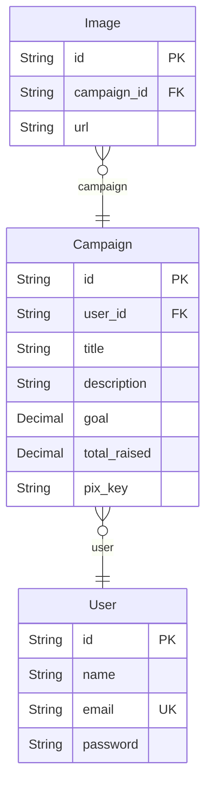

# Doe Aqui
> Generated by [`prisma-markdown`](https://github.com/samchon/prisma-markdown)

- [default](#default)

## default

### `User`

**Properties**
  - `id`: 
  - `name`: 
  - `email`: 
  - `password`: 

### `Image`

**Properties**
  - `id`: 
  - `campaign_id`: 
  - `url`: 

### `Campaign`

**Properties**
  - `id`: 
  - `user_id`: 
  - `title`: 
  - `description`: 
  - `goal`: 
  - `total_raised`: 
  - `pix_key`: 